# Documentación Técnica: Integración de servicios Docker con pfSense

## Descripción general

Este documento describe una infraestructura de servicios desplegados con Docker, organizada en diferentes redes virtuales y preparada para ser gestionada y asegurada mediante pfSense. Se detalla cada servicio, sus configuraciones de red, puertos expuestos y recomendaciones para la configuración de firewall y DNS en pfSense.

---

## Servicios desplegados

### web_pgsql_php (PHP-FPM + PostgreSQL)

- Función: Servicio PHP-FPM que se conecta a PostgreSQL
- Build: `./services/web_pgsql`
- IP: `172.30.0.2`
- Volúmenes:
  - Código fuente: `./services/web_pgsql/public:/var/www/html`
  - Configuración: `./services/web_pgsql/php-fpm.conf:/usr/local/etc/php-fpm.conf`
- Red: `prod_net`

---

### nginx (Servidor web para Drupal)

- Imagen: `nginx:latest`
- IP: `172.30.0.5`
- Puerto expuesto: `80:80`
- Depende de: `web_pgsql_php`
- Volúmenes:
  - Código fuente: `./services/web_pgsql/public:/var/www/html`
  - Configuración Nginx: `./services/web_pgsql/nginx.conf:/etc/nginx/conf.d/default.conf:ro`
- Red: `prod_net`

---

### db (PostgreSQL)

- Imagen: `postgres:13`
- IP: `172.30.0.3`
- Puerto: `5432:5432`
- Variables de entorno:
  - `POSTGRES_DB=example`
  - `POSTGRES_USER=example`
  - `POSTGRES_PASSWORD=example`
- Red: `prod_net`

---

### web_mysql (Apache + PHP + MySQL)

- Build: `./services/web_mysql`
- IP: `172.40.0.2`
- Puerto: `81:80`
- Depende de: `db2`
- Volúmenes: `./services/web_mysql/public:/var/www/html`
- Variables de entorno:
  - `MYSQL_HOST=db2`
  - `MYSQL_USER=example`
  - `MYSQL_PASSWORD=example`
  - `MYSQL_DATABASE=example`
- Red: `dev_net`

---

### db2 (MySQL)

- Imagen: `mysql:8.0`
- IP: `172.40.0.3`
- Puerto: `3307:3306`
- Variables de entorno:
  - `MYSQL_DATABASE=example`
  - `MYSQL_USER=example`
  - `MYSQL_PASSWORD=example`
  - `MYSQL_ROOT_PASSWORD=example`
- Red: `dev_net`

---

### dns (Servidor DNS con BIND9)

- Imagen base: `debian:latest`
- IP: `172.20.0.2`
- Configuración:
  - Instalación de bind9 y herramientas de red básicas
  - Copia de archivos personalizados de configuración de BIND y `resolv.conf`
  - Inicio de bind9 manual vía `systemctl`
- Volúmenes:
  - Archivos de configuración: `named.conf.options`, `named.conf.local`, zonas, resolv.conf
  - Backup: `./backup:/backup`
- Red: `svc_net`

---

## Redes Docker configuradas

| Red        | Subred           | Driver   | Interfaz (parent) |
|------------|------------------|----------|-------------------|
| svc_net    | 172.20.0.0/24    | macvlan  | ens18             |
| prod_net   | 172.30.0.0/24    | macvlan  | ens18             |
| dev_net    | 172.40.0.0/24    | macvlan  | ens18             |

El uso de redes `macvlan` permite que los contenedores sean accesibles desde la red local como si fueran hosts físicos. Esto facilita su gestión directa desde pfSense.

```docker
networks:
  svc_net:
    driver: macvlan
    driver_opts:
      parent: ens18
    ipam:
      config:
        - subnet: 172.20.0.0/24
  prod_net:
    driver: macvlan
    driver_opts:
      parent: ens19
    ipam:
      config:
        - subnet: 172.30.0.0/24
  dev_net:
    driver: macvlan
    driver_opts:
      parent: ens20
    ipam:
      config:
        - subnet: 172.40.0.0/24
```

---

# Proxmox

Para realizar la configuración de nuestro router Pfsense hemos hecho uso del hipervisor **Proxmox**, el cual nos permitirá configurar nuestro router además de una máquina virtual debian que alojará el docker con la infraestructura.

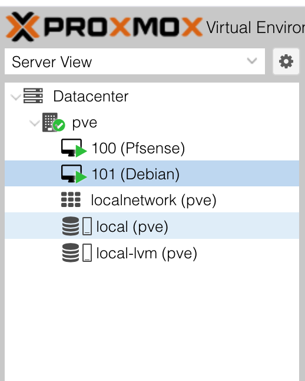

Puedes descargar [Proxmox aquí](https://www.proxmox.com/en/downloads)

## Infraestructura de máquinas virtuales

La infraestructura consta de dos máquinas virtuales principales:

1. **pfSense**: Actuará como router y firewall para gestionar y proteger las redes virtuales. Esta máquina virtual se encargará de:
  - Configurar las reglas de firewall y NAT.
  - Gestionar las conexiones VPN.
  - Proveer servicios de DNS y balanceo de carga.

2. **Debian con Docker**: Contendrá todos los servicios desplegados mediante Docker. Esta máquina virtual está configurada para:
  - Alojar los contenedores descritos en este documento.
  - Gestionar las redes `macvlan` para la integración con pfSense.
  - Proveer acceso a los servicios internos y externos según las configuraciones de red.

Ambas máquinas virtuales están alojadas en el hipervisor **Proxmox**, lo que facilita su administración y escalabilidad.

## Configuración de la máquina virtual Debian

### Configuración de Docker e interfaces de red

#### Instalación de Docker

Para instalar Docker en la máquina virtual Debian, sigue estos pasos:

1. Actualiza los paquetes del sistema:
  ```bash
  sudo apt update && sudo apt upgrade -y
  ```

2. Instala los paquetes necesarios:
  ```bash
  sudo apt install -y apt-transport-https ca-certificates curl software-properties-common
  ```

3. Añade la clave GPG oficial de Docker:
  ```bash
  curl -fsSL https://download.docker.com/linux/debian/gpg | sudo gpg --dearmor -o /usr/share/keyrings/docker-archive-keyring.gpg
  ```

4. Añade el repositorio de Docker:
  ```bash
  echo "deb [arch=amd64 signed-by=/usr/share/keyrings/docker-archive-keyring.gpg] https://download.docker.com/linux/debian $(lsb_release -cs) stable" | sudo tee /etc/apt/sources.list.d/docker.list > /dev/null
  ```

5. Instala Docker y Docker Compose:
  ```bash
  sudo apt update
  sudo apt install -y docker-ce docker-ce-cli containerd.io docker-compose-plugin
  ```

6. Verifica la instalación:
  ```bash
  docker --version
  docker compose version
  ```

#### Despliegue de servicios Docker

1. Clona o copia el repositorio con los archivos de configuración de los servicios:
  ```bash
  git clone <URL_DEL_REPOSITORIO> /ruta/a/tu/proyecto
  cd /ruta/a/tu/proyecto
  ```

2. Construye y levanta los servicios:
  ```bash
  docker compose up -d
  ```

3. Verifica que los contenedores estén corriendo:
  ```bash
  docker ps
  ```

Con esto, la máquina virtual Debian estará lista para alojar los servicios Docker y conectarse a las redes configuradas. Asegúrate de probar la conectividad entre los servicios y las redes desde pfSense y otros clientes.

## Configuración en pfSense

### ¿Qué es pfSense?

**pfSense** es una distribución de software de código abierto basada en FreeBSD, diseñada para actuar como un firewall y router. Es ampliamente utilizada en entornos de redes debido a su flexibilidad, seguridad y capacidad para gestionar configuraciones avanzadas. pfSense incluye características como:

- Firewall de estado
- NAT (Network Address Translation)
- VPN (OpenVPN, IPsec, WireGuard)
- Balanceo de carga
- Monitorización de tráfico
- Portal cautivo
- Soporte para VLANs y más.

Es una solución ideal para redes domésticas, empresariales y de centros de datos.

Puedes descargar pfSense desde su sitio oficial: [Descargar pfSense](https://www.pfsense.org/download/)


### Interfaces de red

Se han creado las interfaces de red correspondientes, mediante **Interfaces** > **Interface Assignments**:

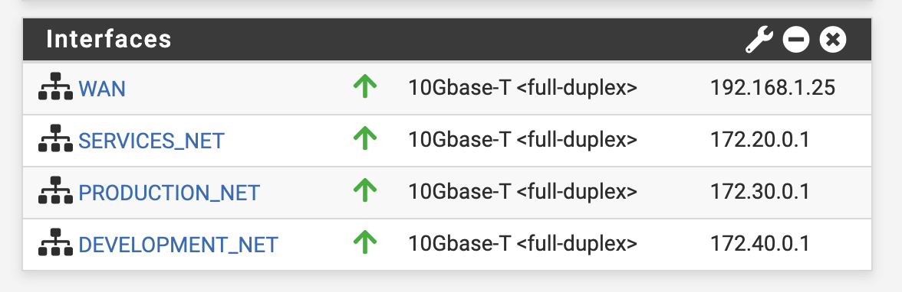

### Reglas de firewall

Se recomienda crear alias de red para una mejor organización de reglas:

- Alias `PRODUCTION_NET` -> `172.30.0.0/24`
- Alias `DEVELOPMENT_NET` -> `172.40.0.0/24`
- Alias `SERVICES_NET` -> `172.20.0.0/24`

#### Reglas red WAN
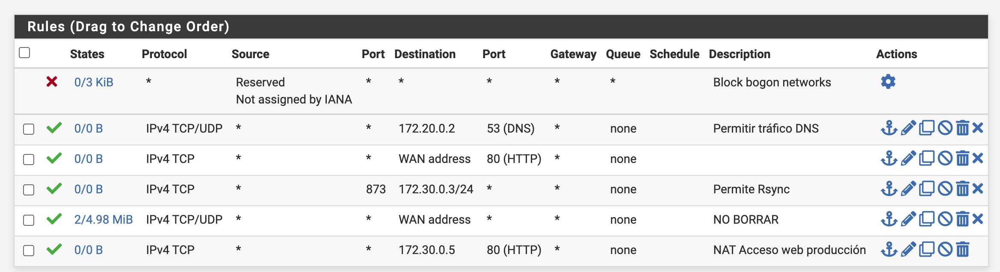
#### Reglas red Servicios
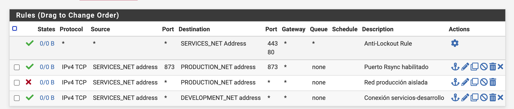
#### Reglas red Producción
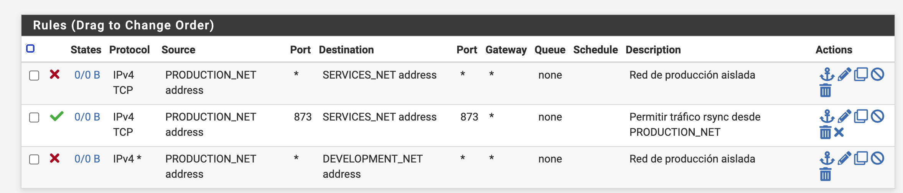
#### Reglas red Desarrollo
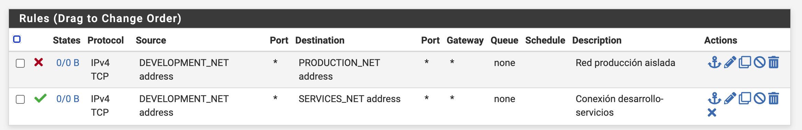
#### Regla VPN
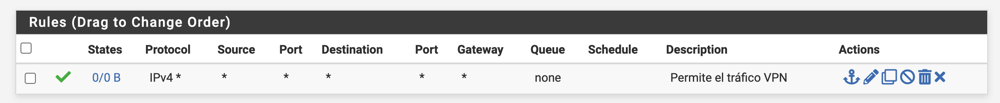
---

### DNS interno

El contenedor `dns` puede ser utilizado como forwarder o resolver para pruebas internas. Se recomienda:

- Asignar manualmente la IP `172.20.0.2` como servidor DNS en los clientes Docker o en el resolver de pfSense.
- Asegurar que las zonas configuradas en BIND (`prod.local`, etc.) estén correctamente configuradas.

---

### NAT / Port forwarding

Para acceder a servicios expuestos desde el exterior:

- Redirigir puerto 80 desde WAN a `172.30.0.5:80` (nginx)
- Redirigir puerto 53 desde WAN a `172.20.0.2:53` (DNS interno)

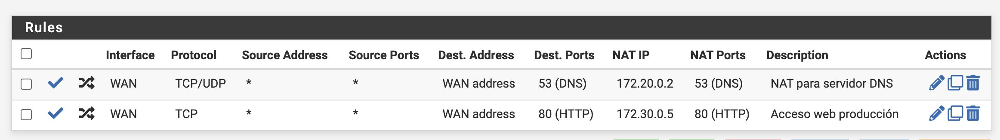

---

## Acceso remoto mediante VPN (OpenVPN)

Se han creado dos túneles VPN independientes usando el **Wizard de pfSense** para facilitar el acceso remoto seguro a las redes segmentadas:

### Usuarios configurados:

| Usuario         | Red objetivo      | Descripción                             |
|-----------------|-------------------|-----------------------------------------|
| `dev-user`      | `172.40.0.0/24`   | Accede a entornos de desarrollo (Apache + MySQL) |
| `svc-prod-user` | `172.20.0.0/24`, `172.30.0.0/24` | Acceso completo a servicios DNS, PostgreSQL y frontend de producción |

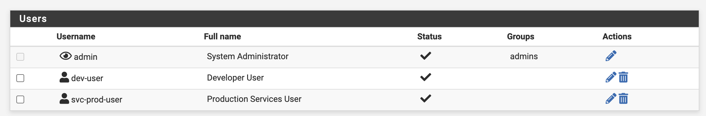

### Certificado CA

Para poder crear las VPNs correspondientes se ha creado un certificado de autoridad, en este caso llamado `CA-VPN`, el cual a partir de él se han creado los certificados de servidor y de clientes.

Certificado CA creado: **System** > **Certificates** > **Autorities**

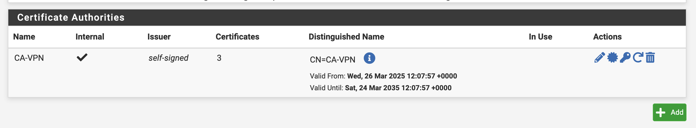

### Características de la configuración:

- Método de autenticación: Certificados individuales por usuario
- Protocolo: OpenVPN (UDP)
- Cifrado: AES-256-CBC
- TLS Auth: Habilitado
- Push de rutas a redes según usuario:
  - `dev-user`: Sólo `172.40.0.0/24`
  - `svc-prod-user`: `172.20.0.0/24` y `172.30.0.0/24`
- Cliente exportado desde: **System > OpenVPN > Client Export**

Resultado de las VPNs creadas con Wizard:
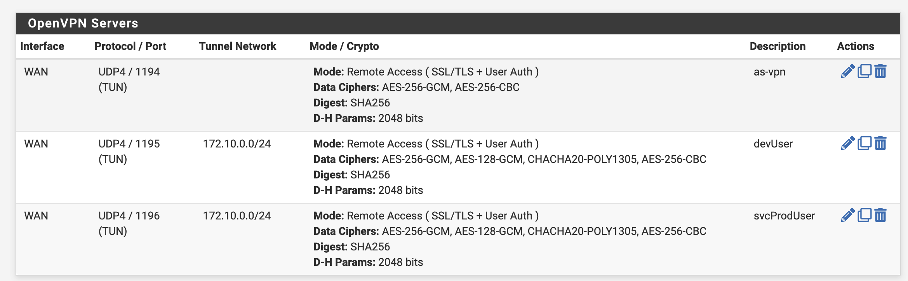

---

## Diagnóstico

Comandos útiles desde hosts locales o desde pfSense:

```bash
ping 172.30.0.2       # Comprobar conectividad con PHP + PostgreSQL
dig @172.20.0.2 prod.local
nmap 172.30.0.0/24    # Escaneo de servicios en red prod
